\# Grafo

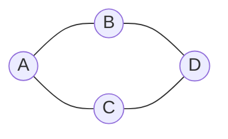


\# Vértice


\# Aresta

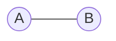


\# Grafo Direcionado (Digrafo)

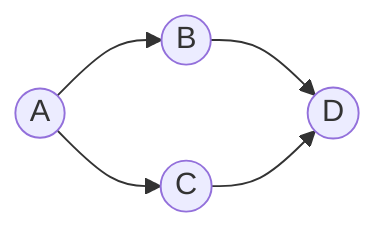


\# Grafo Não Direcionado


\# Grafo Rotulado

As arestas possuem rótulos.

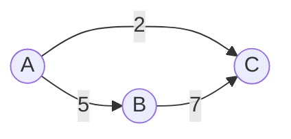


Ou 


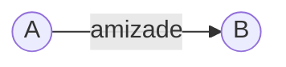


\# Grafo Ponderado

Cada aresta possui um peso.


\# Grafo Simples

Sem laços e sem arestas paralelas.

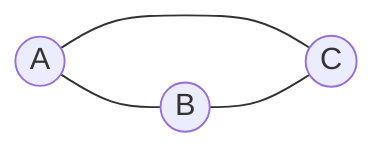


\# Multigrafo

Um multigrafo permite arestas paralelas entre dois vértices.

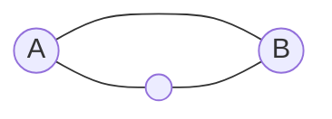


\# Pseudografo

Um pseudografo permite laços (loops).

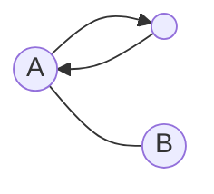


\# Incidência

Uma aresta é incidente aos vértices que ela conecta.

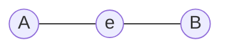


\# Adjacência

Dois vértices são adjacentes quando existe uma aresta entre eles.

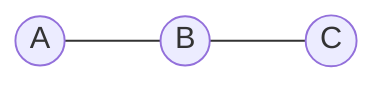


\# Grau

O grau é o número de arestas incidentes em um vértice.

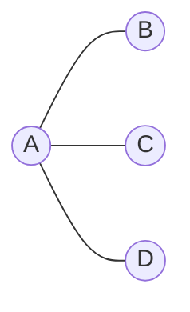


grau(A)=3, grau(B)=1, grau(C)=1, grau(D)=1


\# Grau de Entrada (In-degree)

Conta quantas arestas chegam ao vértice.

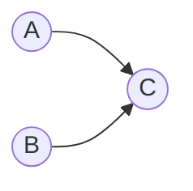

entrada(C)=2


\# Grau de Saída (Out-degree)

Conta quantas arestas saem do vértice.

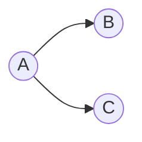

saída(A)=2


\# Laço (Loop)

Uma aresta liga um vértice a ele mesmo.

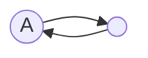


\# Arestas Paralelas

Mais de uma aresta conecta o mesmo par de vértices.


\# Isomorfismo

Dois grafos são isomorfos quando possuem a mesma estrutura, mesmo que os nomes dos vértices sejam diferentes.

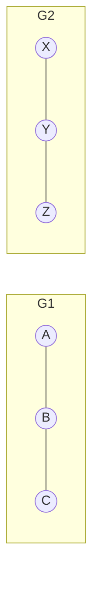

A ↔ X, B ↔ Y, C ↔ Z


\# Caminho


Um \*\*caminho\*\* é uma sequência de vértices conectados por arestas, onde cada vértice consecutivo possui uma aresta entre eles.


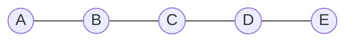


Exemplo:


```text

A → B → C → D → E

```


\---


\# Comprimento do Caminho


O \*\*comprimento\*\* de um caminho é a quantidade de arestas percorridas.


```mermaid

graph LR


A((A))

B((B))

C((C))

D((D))


A --- B

B --- C

C --- D

```


```text

A → B → C → D

```


Número de arestas:


```text

3

```


\---


\# Caminho Simples


Um \*\*caminho simples\*\* não repete vértices.


```mermaid

graph LR


A((A))

B((B))

C((C))

D((D))


A --- B

B --- C

C --- D

```


```text

A → B → C → D

```


Todos os vértices aparecem apenas uma vez.


\---


\# Trilha (Trail)


Uma \*\*trilha\*\* não repete arestas.


Os vértices podem ser repetidos.


```mermaid

graph LR


A((A))

B((B))

C((C))


A --- B

B --- C

C --- A

```


Exemplo:


```text

A → B → C → A

```


Nenhuma aresta foi utilizada duas vezes.


\---


\# Passeio (Walk)


Um \*\*passeio\*\* é a forma mais geral.


Pode repetir vértices e também repetir arestas.


```mermaid

graph LR


A((A))

B((B))

C((C))


A --- B

B --- C

```


Exemplo:


```text

A → B → C → B → A → B

```


Tudo pode ser repetido.


\---


\# Caminho Dirigido


Em um digrafo, todas as arestas devem ser percorridas respeitando sua direção.


```mermaid

graph LR


A((A))

B((B))

C((C))

D((D))


A --> B

B --> C

C --> D

```


Caminho válido:


```text

A → B → C → D

```


Não é permitido:


```text

D → C

```


pois a direção da aresta é oposta.


\---


\# Caminho Mínimo (Shortest Path)


É o caminho de menor custo entre dois vértices.


```mermaid

graph LR


A((A))

B((B))

C((C))

D((D))


A ---|2| B

A ---|8| C

B ---|3| D

C ---|2| D

```


Possibilidades:


```text

A → B → D


Custo = 2 + 3 = 5

```


```text

A → C → D


Custo = 8 + 2 = 10

```


Logo,


```text

Caminho mínimo


A → B → D

```


\---


\# Comparação


| Conceito | Repete vértices | Repete arestas |

|-----------|:---------------:|:--------------:|

| Passeio (Walk) | ✅ | ✅ |

| Trilha (Trail) | ✅ | ❌ |

| Caminho (Path) | ❌ | ❌ |

| Caminho Simples | ❌ | ❌ |

| Caminho Dirigido | ❌ | ❌ (respeitando a direção) |

| Caminho Mínimo | Depende | Depende |


\---


\# Hierarquia


```text

Passeio (Walk)

&#x20;       │

&#x20;       ├────────── Pode repetir tudo

&#x20;       │

&#x20;       ▼

Trilha (Trail)

&#x20;       │

&#x20;       ├────────── Não repete arestas

&#x20;       │

&#x20;       ▼

Caminho (Path)

&#x20;       │

&#x20;       ├────────── Não repete vértices

&#x20;       │

&#x20;       ▼

Caminho Simples

```

