# Grafo

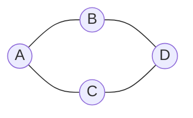

# Vértice


# Aresta

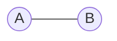

# Grafo Direcionado (Digrafo)

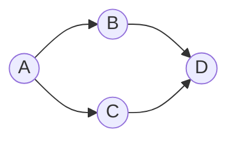

# Grafo Não Direcionado


# Grafo Rotulado

As arestas possuem rótulos.

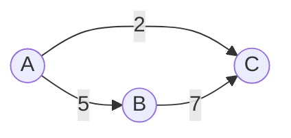

# Grafo Ponderado


# Grafo Simples

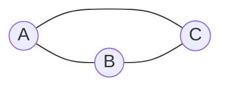

# Incidência

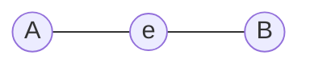

# Adjacência

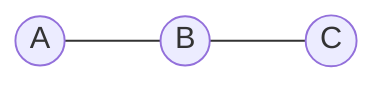

# Grau

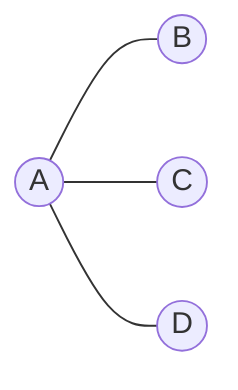

# Grau de Entrada

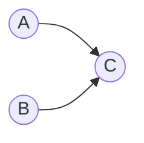

# Grau de Saída

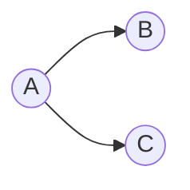

# Caminho

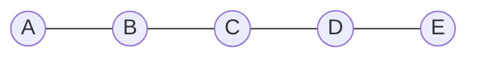

# Caminho Simples

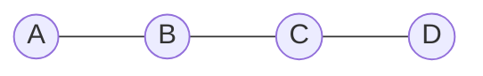

# Trilha (Trail)

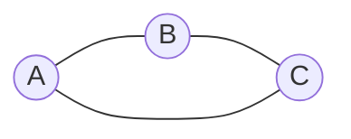

# Passeio (Walk)


# Caminho Dirigido

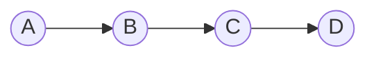

# Caminho Mínimo

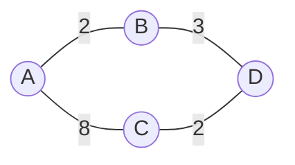

# Comparação

| Conceito | Repete vértices | Repete arestas |
|---|---|---|
| Passeio | Sim | Sim |
| Trilha | Sim | Não |
| Caminho | Não | Não |
| Caminho Simples | Não | Não |

# Hierarquia

```text
Passeio (Walk)
 |
 ▼
Trilha (Trail)
 |
 ▼
Caminho (Path)
 |
 ▼
Caminho Simples
```